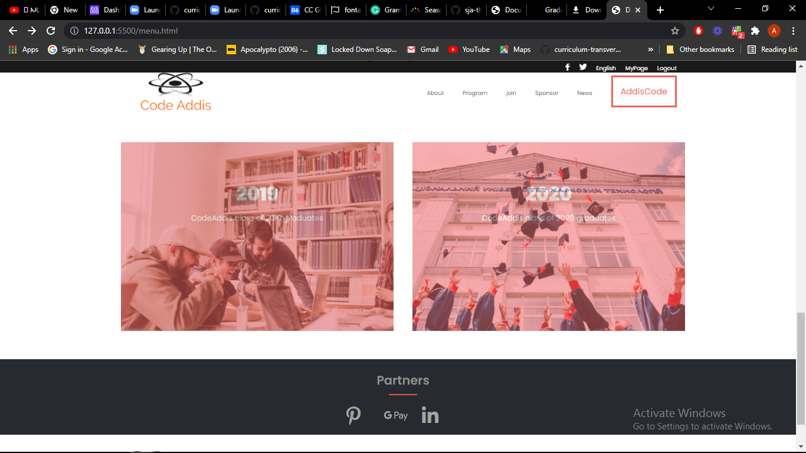
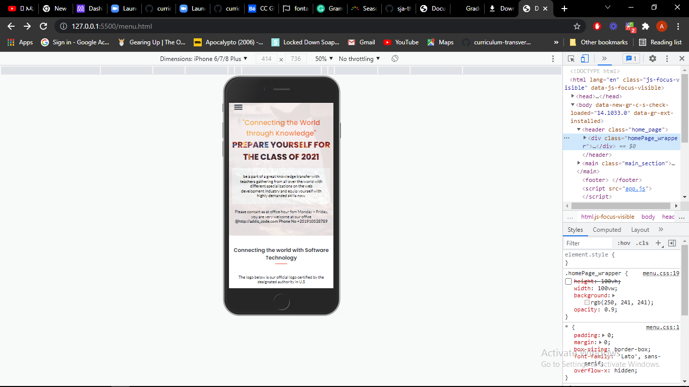

# Capstone_Project_School_Website
> This is Conclusion Project of Module-One Capstone done depending on  the website https://www.behance.net/adagio07. The project is done using five-section tags and sub-tags like div, ul, li, and buttons. The main aim of the project was to build a responsive Capstone webpage depending on a website developed by Sindy Shie. and the duplication process includes replicating all the font styles, font sizes, line heights, box dimensions, and all the margins and padding dimensions.

## user instruction
Anyone who wants to use the project can get it on the git hub website using the keyword "PortofolioMobileVersionRep".
Then use the following instruction to clone the project and use it.
1. click on the green button which is labeled "Code" and copy the path for the project.
2. got to your local command compiler and select a directory that you want your project to be in. and you can do this by using the command "cd" or create a new one using the command "mkdr"
3. clone the project using the keyword "git clone <DirectoryName>" which is copied from git hub
4. create a new branch with the keyword "git branch <BranchName>" 
5. switch your branch to the new branch that you have just created and using the keyword "branch checkout <BranchName>"
6.  now work on the project make changes that you want to make and after making the changes add it to the staging area by using the command "git add <docName>" or use the "add ." to add all the edited files at once.
7. commit the files in the staging area with the command "git commit -m 'put a message here"
8. push your code to the remote repository using the command "git push origin <branchName>"

Example of Desktop Version of the project
<<<<<<< HEAD

Example of Mobile Version of the project
=======

>>>>>>> 09c9669cdb2bd0040ef5eced8448de4387849987
  
##  [Live Demo](https://addisalemseifu.github.io/Capstone_Pro_One/)
  
##  [Loom video](https://www.loom.com/share/2c2b043b715846daac2c12c9c150d88a)

## Built With
- HTML,CSS,Javascript
- git and git hub

## Authors
👤 Addisalem Seifu
- GitHub: [@addisalemseifu](https://github.com/githubhandle)
- Twitter: [@Addisalem Seifu](https://twitter.com/twitterhandle)
- LinkedIn: [addisalem seifu](https://linkedin.com/in/linkedinhandle)

## 🤝 Contributing
Contributions, issues, and feature requests are welcome!

## Show your support
Give a ⭐️ if you like this project!

## 📝 License

This project is [MIT](./MIT.md) licensed.
